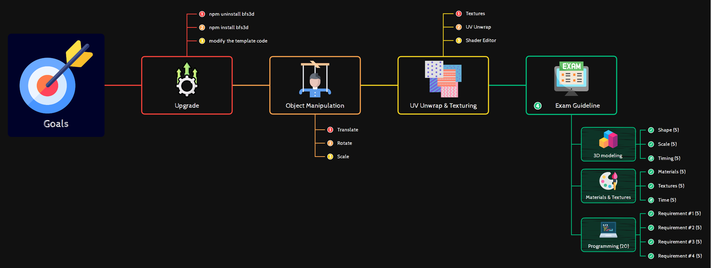

# bits-fusion 3D library

## How to use it?

### Download
Download the project files (git clone is recommended).

### Setup
Open terminal and run `npm i` to install the library and all dependencies.

### Run
Open terminal and run `npm run dev`.

---

## How to upgrade the project?

1 Uninstall the `bfs3d`
```
npm uninstall bfs3d
```

2 Install the latest version of the `bfs3d`
```
npm install bfs3d
```

3 Update the code (check the `+page.svelte` and `main.ts`)

---

## Goals



---